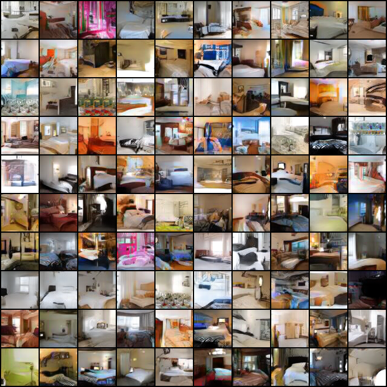

# Joint Training of Variational Auto-Encoder and Latent Energy-Based Model

Implementation for [Joint Training of Variational Auto-Encoder and Latent Energy-Based Model](https://arxiv.org/abs/2006.06059).

## Pretrained Models

Pretrained models can be accessed [here](https://www.dropbox.com/s/a3xydf594fzaokl/cifar10_pretrained.rar?dl=0).

## Requirements:

Make sure the following environments are installed.

```
tensorflow-gpu=1.14.0
torchvision=0.4.0
pytorch=1.2.0
scipy=1.1.0
scikit-learn=0.21.2
Pillow=6.2.0
matplotlib=3.1.1
seaborn=0.9.0
```
The code was tested on Unbuntu with GPU V100 and RTX 2070 super. Other platforms may/may not have numerical instablities. Under different GPU setups we noticed that FID/MSE can be relatively stable while the latent EBM is less so, and we will address this and aim to develop robust ebm learning in future works. 


## Training on CIFAR-10:

```python train_cifar.py ```

Please refer to the python file for optimal training parameters.

## Results

Some generative results are as follows.


&nbsp;&nbsp;



## Reference

```
@inproceedings{han2020joint,
  title={Joint Training of Variational Auto-Encoder and Latent Energy-Based Model},
  author={Han, Tian and Nijkamp, Erik and Zhou, Linqi and Pang, Bo and Zhu, Song-Chun and Wu, Ying Nian},
  booktitle={Proceedings of the IEEE/CVF Conference on Computer Vision and Pattern Recognition},
  pages={7978--7987},
  year={2020}
}
```

## Acknowledgement

Thanks to [@Tian Han ](https://github.com/hthth0801?tab=repositories) and [@Erik Njikamp](https://github.com/enijkamp) for their colloboration and guidance.